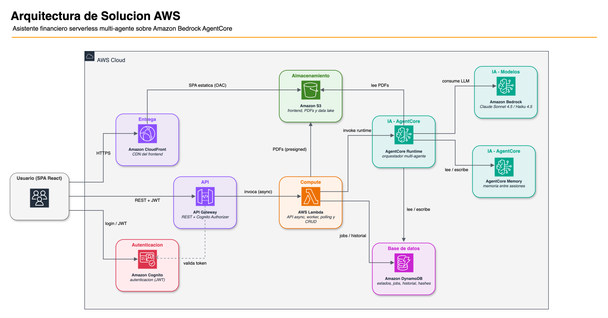
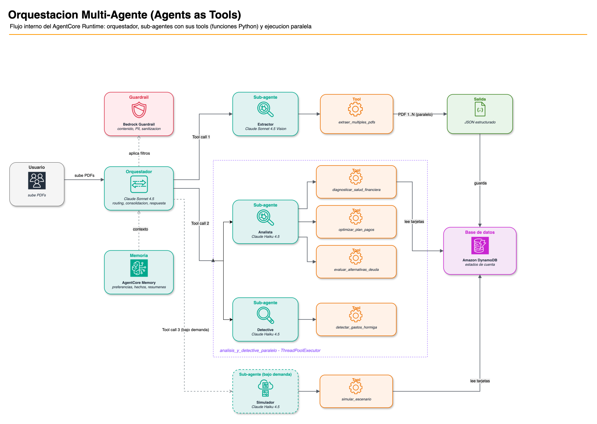

# Análisis multi-agente de salud financiera con Amazon Bedrock AgentCore

[English](README.md) | **Español**

Este ejemplo es un sistema multi-agente que analiza deudas de tarjeta de
crédito. Lee
los estados de cuenta, diagnostica la salud financiera del usuario y detecta los
gastos hormiga. Después construye un plan de pagos optimizado con gráficos
interactivos.

El sistema usa [Amazon Bedrock AgentCore](https://aws.amazon.com/bedrock/agentcore/)
y el [Strands Agents SDK](https://github.com/strands-agents/sdk-python).

> **PRECAUCIÓN:** Elimina los recursos cuando ya no los necesites. Este proyecto
> crea recursos de AWS que generan cargos en tu cuenta. Consulta
> [Limpieza](#limpieza) y la [calculadora de precios de AWS](https://calculator.aws/).

La interfaz está disponible en español y en inglés. Configura el idioma en tu
perfil. Los agentes responden en el idioma que selecciones.

El ejemplo apunta a los mercados de crédito de América Latina, donde las tasas de
interés y la terminología cambian según el país. Algunos términos del dominio
mantienen su forma local. Por ejemplo, TCEA en Perú, CAT en México y CAE en Chile
nombran el costo anual efectivo del crédito.

## Prerrequisitos

- AWS CLI v2, configurado con credenciales
- Node.js 18 o posterior, con npm
- Python 3.10 o posterior, con pip
- CDK CLI v2, con versión fija para builds reproducibles:
  `npm install -g aws-cdk@2.1136.0`
- Acceso a Amazon Bedrock en tu región de despliegue, para Claude Sonnet 4.5 y
  Claude Haiku 4.5
- Docker (opcional). Si Docker no está presente, el build instala las
  dependencias ARM64 de forma local.

> **NOTA:** Las funciones Lambda y el AgentCore Runtime ejecutan Python 3.13. El
> build apunta a 3.13 de forma explícita con `pip --python-version`, así que tu
> versión local de Python puede ser distinta.

## Despliegue

Ejecuta `deploy.sh`. El script valida los prerrequisitos,
instala las dependencias, ejecuta `cdk bootstrap` si es necesario y crea el
stack.

El stack contiene AgentCore Runtime, AgentCore Memory, un guardrail de Bedrock,
las funciones Lambda, API Gateway, tablas de DynamoDB, buckets de S3, CloudFront
y Cognito.

Elige una región que tenga Amazon Bedrock AgentCore y los modelos Claude. Por
ejemplo: `us-east-1`, `us-east-2` o `us-west-2`.

### 1. Crea la infraestructura

El primer despliegue tarda entre 10 y 15 minutos.

```bash
export AWS_REGION=us-east-1
export AWS_PROFILE=my-profile    # opcional, usa 'default' si no lo defines
./deploy.sh
```

El script muestra los outputs y escribe `cdk-outputs.json`. Ese archivo contiene
el User Pool ID, la URL de la API, la URL de CloudFront y los demás valores.

```
✅ DEPLOY COMPLETE
  API Gateway: https://xxxxx.execute-api.us-east-1.amazonaws.com/prod/
  CloudFront:  https://dxxxxx.cloudfront.net
```

### 2. Crea un usuario

Lee el campo `UserPoolId` en `cdk-outputs.json`.

```bash
aws cognito-idp admin-create-user \
  --user-pool-id <USER_POOL_ID> \
  --username tu-email@example.com \
  --user-attributes Name=email,Value=tu-email@example.com Name=email_verified,Value=true \
  --temporary-password "TuPassword123!" \
  --region $AWS_REGION \
  --profile $AWS_PROFILE
```

Después marca la contraseña como permanente. Este paso evita el cambio forzado de
contraseña en el primer inicio de sesión.

```bash
aws cognito-idp admin-set-user-password \
  --user-pool-id <USER_POOL_ID> \
  --username tu-email@example.com \
  --password "TuPassword123!" \
  --permanent \
  --region $AWS_REGION \
  --profile $AWS_PROFILE
```

### 3. Abre la aplicación

Usa la URL de CloudFront del resultado del despliegue.

```bash
open https://dxxxxx.cloudfront.net
```

### Iteración rápida

Para desplegar solo los cambios del backend, usa `--hotswap`. Esto tarda unos 5
segundos.

```bash
cd infrastructure && cdk deploy FinancialHealthStack --hotswap
```

## Cómo usar la aplicación

### 1. Configura tu perfil

Abre **Mi Perfil**. La aplicación necesita el ingreso mensual y la conducta de
pago antes de que subas un estado de cuenta.

- **País.** El país define la moneda (S/, $, R$) y la terminología de tasas
  (TCEA, CAT, CAE).
- **Idioma.** El idioma se aplica a la interfaz y a las respuestas de los
  agentes. Elige español o inglés.
- **Ingreso mensual.** El sistema necesita este valor para calcular los ratios y
  los presupuestos.
- **Conducta de pago.** Este valor indica si pagas el monto mínimo o el total del
  estado de cuenta. Cambia las proyecciones.

### 2. Sube los estados de cuenta

Abre la pestaña **Documentos**.

1. Selecciona **Subir PDFs**.
2. Selecciona los estados de cuenta de tus tarjetas. La aplicación acepta
   tarjetas bancarias y tarjetas de tiendas.
3. Para probar la aplicación sin datos reales, usa los archivos PDF sintéticos de
   `demo/pdfs/`. Consulta [Archivos PDF de prueba](#archivos-pdf-de-prueba).

La aplicación acepta hasta 5 archivos en paralelo. Detecta los archivos
duplicados con un hash SHA-256.

### 3. Espera el análisis

El análisis arranca de forma automática cuando termina la subida. La aplicación
abre la pestaña **Análisis** y muestra una barra de progreso por etapa.

El análisis tarda entre 90 y 180 segundos. El sistema extrae los datos de cada
archivo PDF, diagnostica la salud financiera, detecta los gastos hormiga y
construye una estrategia optimizada.

Para analizar de nuevo los estados de cuenta que ya subiste, usa el botón
**ANALIZAR**. Aparece en la pestaña **Documentos**, debajo de la lista, cuando al
menos un estado de cuenta tiene el estado `Analizado`.

### 4. Lee los resultados

El análisis produce un texto narrativo que contiene gráficos interactivos.

El orquestador emite cada gráfico como un bloque de datos en su respuesta, así
que el número de gráficos cambia entre ejecuciones. Cada análisis produce entre
tres y cinco de los gráficos siguientes. El gráfico de simulación aparece solo
después de que haces una pregunta hipotética en el chat.

| Gráfico | Contenido |
|---|---|
| Composición de deuda | Cada tarjeta con su saldo, su tasa y su pago mínimo |
| Distribución de gastos | Gastos recurrentes por categoría |
| Alternativas de pago | Avalancha, bola de nieve y consolidación comparadas |
| Evolución de deuda | Pagos mínimos comparados con el plan optimizado, mes a mes |
| Intereses acumulados | El dinero que va a intereses en cada escenario |
| Simulación | Un escenario que pides, comparado con tu plan actual |

### 5. Simula un escenario

Después del análisis, usa el chat para hacer una pregunta. Por ejemplo:

- *"¿Qué pasa si recibo una gratificación de S/ 7,000?"*
- *"¿Qué pasa si recorto S/ 300 al mes en delivery?"*
- *"¿Qué pasa si hago una compra de S/ 2,000 en 12 cuotas?"*

El agente simulador responde cada pregunta con los datos de tus propios estados
de cuenta. No cambia el análisis guardado.

### 6. Sigue tu progreso

Abre la pestaña **Evolución**. Sube estados de cuenta nuevos cada mes. La
aplicación los compara con el análisis anterior y muestra tu progreso.

AgentCore Memory almacena el contexto entre sesiones, así que el análisis no
empieza de cero cada mes.

## Arquitectura



El sistema usa el patrón
[Agents as Tools](https://strandsagents.com/latest/user-guide/concepts/multi-agent/agents-as-tools/).
El orquestador elige el agente según la intención del usuario.

| Agente | Modelo | Función |
|---|---|---|
| **Orquestador** | Claude Sonnet 4.5 con guardrails | Coordina los agentes, consolida los resultados y gestiona la memoria |
| **Extractor** | Claude Sonnet 4.5 | Extrae datos estructurados de los archivos PDF en paralelo |
| **Analista** | Claude Haiku 4.5 | Diagnostica la salud financiera y construye el plan de pagos y las alternativas |
| **Detective** | Claude Haiku 4.5 | Detecta los gastos hormiga por categoría |
| **Simulador** | Claude Haiku 4.5 | Evalúa escenarios hipotéticos |

### Colaboración entre agentes



El usuario habla solo con el orquestador. El orquestador no contiene lógica de
negocio. Elige el sub-agente, y cada sub-agente es dueño de las tools de Python
que hacen el trabajo.

Dos servicios participan en cada llamada al modelo. AgentCore Memory proporciona
el contexto almacenado de las sesiones anteriores. El guardrail de Bedrock filtra
la entrada y la salida.

**Llamada 1, extracción.** El orquestador llama al Extractor. La tool
`extraer_multiples_pdfs` lee los archivos PDF en paralelo y devuelve JSON
estructurado. El sistema escribe el resultado en DynamoDB.

**Llamada 2, análisis.** El orquestador llama al Analista y al Detective. Ambos
corren al mismo tiempo en un `ThreadPoolExecutor`, dentro de
`analisis_y_detective_paralelo`. El Analista es dueño de tres tools:
`diagnosticar_salud_financiera`, `optimizar_plan_pagos` y
`evaluar_alternativas_deuda`. El Detective es dueño de `detectar_gastos_hormiga`.
Cada tool lee los datos de las tarjetas desde DynamoDB.

**Llamada 3, simulación.** Esta llamada ocurre solo bajo demanda. Cuando el
usuario hace una pregunta hipotética en el chat, el orquestador llama al
Simulador, que usa `simular_escenario`.

Después el orquestador consolida los resultados y escribe la respuesta.

Dos propiedades de este diseño importan. Las tools hacen la aritmética, no los
modelos, así que cada número de la salida viene de Python y no de una predicción.
Cada sub-agente recibe solo los datos de su propia tarea, lo que mantiene los
prompts pequeños y el costo bajo.

### Servicios de AWS

- **Amazon Bedrock AgentCore.** Runtime serverless sobre microVMs, Memory para la
  persistencia entre sesiones y guardrails para filtrar contenido y PII.
- **Amazon Bedrock.** Los modelos Claude Sonnet 4.5 y Claude Haiku 4.5.
- **AWS Lambda.** Dispatcher, worker, URLs prefirmadas y polling.
- **Amazon API Gateway.** Una API REST con un autorizador de Cognito.
- **Amazon DynamoDB.** Estados de cuenta, jobs e historial financiero.
- **Amazon S3.** Archivos PDF temporales, frontend estático y datalake de
  analytics.
- **Amazon CloudFront.** La CDN del frontend.
- **Amazon Cognito.** Autenticación de usuarios.

### Decisiones técnicas

**Agents as Tools.** Cada sub-agente es una `@tool` que el orquestador puede
llamar. El orquestador elige el agente según la intención del usuario, así que el
código no tiene flujos hardcodeados.

**Ejecución paralela.** El analista y el detective corren al mismo tiempo en un
`ThreadPoolExecutor`. El sistema lee los datos de DynamoDB antes de crear los
sub-agentes. Este orden evita que el modelo invente datos.

**Contexto de usuario determinístico.** El valor `usuario_id` es la clave de
partición de DynamoDB. Sin ese valor el sistema no puede leer ni escribir nada.

El sistema no depende del modelo para propagar el valor a través de los prompts.
El valor debe sobrevivir varios pasos de decisión del modelo, y un solo olvido
deja al usuario sin datos. En cambio, el entrypoint fija el valor una vez en
código, en `backend/config/request_context.py`. Las tools de persistencia lo leen
de ahí cuando el modelo no lo entrega como argumento. El orden de precedencia es
primero el argumento explícito del modelo y después el contexto de la petición.

**Selección de modelos por costo.** El sistema usa Sonnet 4.5 solo donde es
necesario, para el routing complejo y para la visión multimodal. Los workers usan
Haiku 4.5, porque las tools de Python hacen los cálculos y el modelo solo
formatea el resultado.

El costo estimado es de unos 0.10 USD por sesión completa. Esta estimación usa
los precios de Amazon Bedrock para Claude Sonnet 4.5 y Claude Haiku 4.5 de enero
de 2026. Asume una sesión típica de 3 archivos PDF de unas 2 páginas cada uno.
Para los precios actuales por región, consulta
[Amazon Bedrock Pricing](https://aws.amazon.com/bedrock/pricing/).

**Guardrails con recuperación de falsos positivos.** Cada llamada al modelo pasa
por un guardrail de Bedrock que anonimiza la PII y filtra el contenido dañino. El
lenguaje financiero activa esos filtros con frecuencia. Un usuario que pregunta
*"¿qué pasa si me despiden?"* usa palabras que activan los filtros de violencia y
de mala conducta. Cuando el guardrail bloquea una pregunta legítima,
`backend/agentcore_entrypoint.py` reformula el texto y reintenta una vez, en
lugar de mostrar un rechazo al usuario. Consulta la sección de Uso responsable de
IA para saber qué aplica el guardrail y qué no.

**Memoria entre sesiones.** El sistema usa tres estrategias: preferencias del
usuario, hechos financieros y resúmenes de sesión. Estas estrategias hacen
posible la comparación mensual.

## Uso responsable de IA

Esta es una aplicación de IA de alto riesgo. Analiza información financiera
personal y recomienda estrategias de deuda. Por eso aplica los controles y los
descargos siguientes.

**Esta aplicación no es asesoría financiera profesional.** Entrega un análisis
informativo y educativo. Las proyecciones y los cálculos son estimaciones a
partir de los datos que sube el usuario, y los resultados reales pueden variar.
El análisis **no debe ser la única base** de una decisión financiera. Para una
decisión importante, consulta a un asesor calificado.

El descargo aparece en el prompt del sistema del orquestador, en
`backend/agents/orquestador.py`, y en los textos de la interfaz, en los archivos
i18n del frontend.

**Guardrails.** Cada llamada al modelo pasa por un guardrail de Bedrock. El stack
lo crea en `infrastructure/` con el nombre `financial-health-guardrail`. Esto es
lo que aplica y lo que no:

| Control | Configuración |
|---|---|
| Violencia, contenido sexual, odio, insultos | fuerza `HIGH`, entrada y salida |
| Mala conducta | fuerza `LOW`, entrada y salida |
| Anonimización de PII: número de tarjeta, email, teléfono, dirección | entrada y salida |
| Mensaje de bloqueo | neutral, no alarmista |
| Ataque de prompt | declarado, **fuerza `NONE`, así que no hace nada** |
| Temas denegados | **ninguno configurado** |

Las dos últimas filas son decisiones deliberadas, no descuidos. Entiéndelas antes
de reutilizar este ejemplo.

**El guardrail no detecta ataques de prompt.** El stack declara el filtro con
fuerza `NONE`, así que el filtro nunca actúa. El filtro se queda en `NONE` porque
también bloquea preguntas normales sobre deudas.

Cada opción tiene un costo. Con `NONE`, el guardrail no protege contra la
inyección de prompts. Con una fuerza mayor, el guardrail rechaza preguntas
legítimas. **Para producción, sube la fuerza.** Reserva tiempo para reducir los
falsos positivos. Cambia `content_policy_config` en
`infrastructure/infrastructure/infrastructure_stack.py`.

**No hay política de temas.** Bedrock puede rechazar materias completas, como la
asesoría legal, las inversiones o las criptomonedas. Este guardrail no configura
ninguna.

El prompt del sistema del orquestador rechaza esas materias en su lugar, y ese
mecanismo es más débil. Un usuario decidido puede llevar al modelo más allá de
una regla del prompt. Una política de temas bloquea la petición antes de que el
modelo la vea. **Para producción, agrega al guardrail los temas que te importen**
con `topic_policy_config`, y deja las reglas del prompt como segunda capa.

**Límites en el comportamiento del modelo.** El prompt del sistema evita cuatro
cosas. El agente no debe recomendar un banco sobre otro. El agente no debe
garantizar un resultado. El agente no debe dar asesoría legal. El agente debe
añadir un descargo breve a cada plan de pagos, simulación y estrategia de deuda.

**Manejo de datos.** Los estados de cuenta y los datos derivados pertenecen al
usuario, y el usuario puede eliminarlos todos. Consulta [Limpieza](#limpieza).

> **PRECAUCIÓN:** No subas datos financieros reales a un entorno de
> demostración. Usa datos claramente sintéticos.

**Cumplimiento PCI-DSS en producción.** Este proyecto es un prototipo. Un
despliegue en producción que maneje datos de tarjetas de crédito necesita
controles adicionales de PCI-DSS. Los datos de tarjeta son el PAN completo, el
CVV y la fecha de expiración. Los controles adicionales incluyen la tokenización
del PAN, el cifrado en tránsito y en reposo, la segmentación de red, la auditoría
y las políticas de retención.

Esta aplicación procesa solo los últimos 4 dígitos y los saldos agregados. Nunca
procesa el PAN completo. Aun así, cualquier ampliación del alcance debe pasar una
evaluación PCI-DSS.

## Estructura del proyecto

```
├── backend/
│   ├── agents/              # Definición de agentes (orquestador, extractor, analista, detective, simulador)
│   ├── tools/               # Tools que llaman los agentes (extracción, análisis, DynamoDB)
│   ├── config/              # Modelos de Bedrock, constantes, contexto de petición
│   ├── lambda/              # Funciones Lambda (dispatcher, worker, poll, upload, history)
│   ├── tests/               # Pruebas unitarias del backend
│   ├── agentcore_entrypoint.py  # Entrypoint de AgentCore Runtime
│   └── requirements.txt
├── frontend/
│   ├── src/
│   │   ├── components/      # Chat, PdfUploader, ChartRenderer, ProfileSettings y otros
│   │   ├── hooks/           # useAgent (polling asíncrono)
│   │   ├── utils/           # Parsing de respuestas, países
│   │   └── i18n/            # Internacionalización (es/en)
│   └── package.json
├── infrastructure/
│   ├── infrastructure/
│   │   └── infrastructure_stack.py  # El stack de CDK completo
│   └── app.py
├── demo/
│   └── pdfs/                # Estados de cuenta sintéticos para pruebas
├── diagrams/                # Diagramas de arquitectura (fuentes .drawio y renders .png)
├── threat-model/            # Modelo de amenazas STRIDE (formato Threat Composer)
├── deploy.sh                # Script de despliegue (un solo comando)
└── test-e2e.sh              # Prueba end-to-end (credenciales por variables de entorno)
```

## Variables de entorno

El stack de CDK configura todos estos valores. Esta sección es una referencia.

### Backend, mediante SSM Parameter Store

| Variable | Descripción |
|---|---|
| `AWS_REGION` | La región de AWS |
| `DYNAMODB_TABLE_NAME` | La tabla de DynamoDB para los estados de cuenta |
| `HASHES_TABLE_NAME` | La tabla de DynamoDB para la detección de duplicados |
| `UPLOAD_BUCKET` | El bucket de S3 para los archivos PDF |
| `MEMORY_ID` | El identificador de AgentCore Memory |
| `GUARDRAIL_ID` | El identificador del guardrail de Bedrock |
| `GUARDRAIL_VERSION` | La versión del guardrail |
| `BEDROCK_ORCHESTRATOR_MODEL` | El modelo del orquestador (Sonnet 4.5) |
| `BEDROCK_EXTRACTOR_MODEL` | El modelo del extractor (Sonnet 4.5) |
| `BEDROCK_WORKER_MODEL` | El modelo de los workers (Haiku 4.5) |

### Frontend, en `.env`

El script `deploy.sh` genera este archivo.

| Variable | Descripción |
|---|---|
| `VITE_API_URL` | La URL de API Gateway |
| `VITE_USER_POOL_ID` | El identificador del user pool de Cognito |
| `VITE_USER_POOL_CLIENT_ID` | El identificador del app client de Cognito |

## Archivos PDF de prueba

El directorio `demo/pdfs/` contiene estados de cuenta sintéticos de tarjeta de
crédito. Úsalos para probar la aplicación sin datos reales. Los nombres de las
entidades financieras y de los comercios son inventados.

Para generar los archivos de nuevo, ejecuta
`python3 demo/generate-statements.py`. Para subirlos, usa la pestaña
**Documentos**.

| Usuario | Tarjetas (entidades inventadas) |
|---|---|
| **Carolina** | Banco Vantia, Tiendas Orvia, Tiendas Delsu |
| **Miguel** | Banco Nordika, Banco Marena |

## Pruebas

### Pruebas unitarias

```bash
cd backend && python3 -m pytest tests/ -q                    # contexto de usuario determinístico
cd infrastructure && .venv/bin/python -m pytest tests/ -q    # síntesis del stack de CDK
```

### Prueba end-to-end

El script `test-e2e.sh` ejecuta el flujo completo contra un stack desplegado.
Autentica con Cognito, sube 3 archivos PDF, arranca el análisis, verifica la
persistencia y hace 10 preguntas de chat.

```bash
export AWS_REGION=us-east-1
export AWS_PROFILE=my-profile
export TEST_EMAIL=<usuario-cognito>
export TEST_PASSWORD=<contraseña>
./test-e2e.sh
```

El script verifica el **contenido**, no solo que los jobs terminen.

| Comprobación | Criterio |
|---|---|
| Subida | Las 3 URLs prefirmadas responden HTTP 200 |
| Análisis | La respuesta contiene bloques `:::chart` y nombra una entidad de los archivos PDF |
| Persistencia | Los estados de cuenta extraídos existen en DynamoDB para ese `usuario_id` |
| Chat | Una respuesta que dice no tener los datos del usuario cuenta como **fallo** |

El script termina con un código distinto de cero después de un fallo. Un job que
llega a `COMPLETED` con una respuesta genérica no es un éxito. El primer análisis
puede funcionar mientras la persistencia está rota, y entonces los turnos de chat
posteriores no tienen datos.

Crea un usuario nuevo en cada ejecución completa. La detección de duplicados usa
el valor `usuario_id` y un hash SHA-256. Si repites los mismos archivos PDF con el
mismo usuario, la aplicación salta la subida y el análisis no se ejecuta.

## Limpieza

```bash
cd infrastructure
cdk destroy FinancialHealthStack
```

> **PRECAUCIÓN:** Este comando elimina de forma permanente todos los datos.
> Elimina las tablas de DynamoDB, los archivos PDF en S3, los usuarios de
> Cognito, AgentCore Runtime, AgentCore Memory y el guardrail.

## Licencia

Este proyecto usa la licencia [MIT-0](LICENSE), es decir, MIT No Attribution.

| Archivo | Contenido |
|---|---|
| [`LICENSE`](LICENSE) | El texto completo de MIT-0 |
| [`NOTICE`](NOTICE) | El aviso de copyright y una referencia a las dependencias de terceros |
| [`THIRD-PARTY-LICENSES`](THIRD-PARTY-LICENSES) | Una auditoría de licencias de cada dependencia del backend, la infraestructura y el frontend |

**Dependencias de terceros.** Este repositorio no incluye ninguna dependencia
dentro del código. Cada dependencia tiene una versión fija, y el build la descarga
desde PyPI o desde npm.

El cierre completo de dependencias usa solo licencias permisivas: MIT,
Apache-2.0, BSD, ISC, 0BSD y MPL-2.0 en un caso sin modificar. Ninguna
dependencia tiene una licencia copyleft fuerte ni una restricción de campo de uso.
Para el detalle, y para las notas sobre `certifi`, `victory-vendor` y
`caniuse-lite`, consulta [`THIRD-PARTY-LICENSES`](THIRD-PARTY-LICENSES).

**Datos de demostración.** Los estados de cuenta de `demo/pdfs/` son sintéticos.
Usan entidades financieras y comercios inventados. No contienen datos financieros
reales de ninguna persona.
