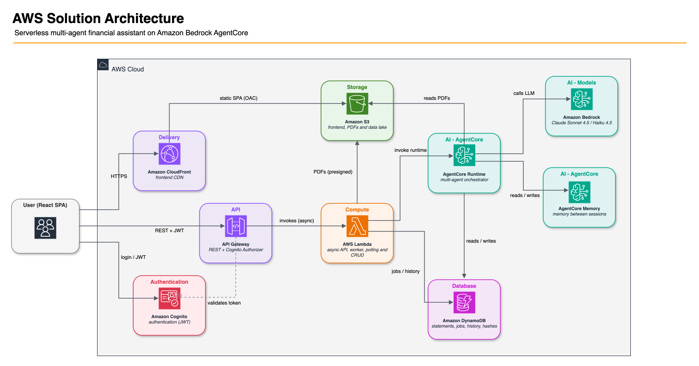
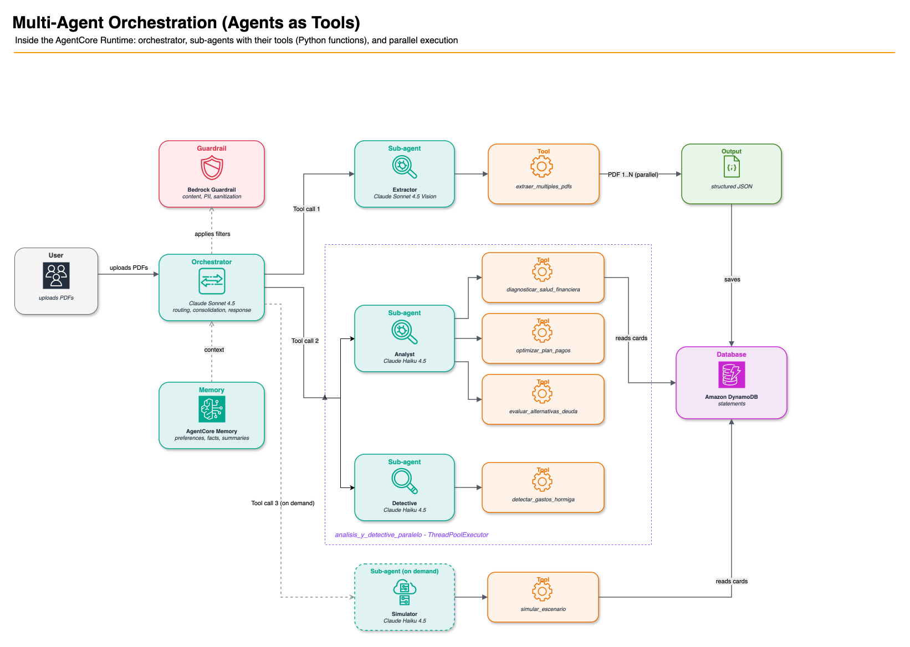

# Multi-agent financial health analysis with Amazon Bedrock AgentCore

**English** | [Español](README.es.md)

This sample is a multi-agent system that analyzes credit card debt. It reads
statements, diagnoses the financial health of the user, and finds small recurring
expenses. Then it builds an optimized payment plan with interactive charts.

The system uses [Amazon Bedrock AgentCore](https://aws.amazon.com/bedrock/agentcore/)
and the [Strands Agents SDK](https://github.com/strands-agents/sdk-python).

For the design decisions behind this sample, read
[Construye un sistema multi-agente de salud financiera con Amazon Bedrock AgentCore](https://aws.amazon.com/es/blogs/aws-spanish/construye-un-sistema-multi-agente-de-salud-financiera-con-amazon-bedrock-agentcore/)
on the AWS Spanish blog. The post is in Spanish.

> **CAUTION:** Delete the resources when you no longer need them. This project
> creates AWS resources that add charges to your account. See
> [Cleanup](#cleanup) and the [AWS Pricing Calculator](https://calculator.aws/).

The interface is available in English and in Spanish. Set the language in your
profile. The agents answer in the language that you select.

The sample targets Latin American credit markets, where interest rates and
terminology differ by country. Some domain terms keep their local form because
they have no direct English equivalent. For example, TCEA in Peru, CAT in Mexico,
and CAE in Chile all name the effective annual cost of credit.

## Prerequisites

- AWS CLI v2, configured with credentials
- Node.js 18 or later, with npm
- Python 3.10 or later, with pip
- CDK CLI v2, pinned for reproducible builds: `npm install -g aws-cdk@2.1136.0`
- Access to Amazon Bedrock in your deployment Region, for Claude Sonnet 4.5 and
  Claude Haiku 4.5
- Docker (optional). If Docker is absent, the build installs the ARM64
  dependencies locally instead.

> **NOTE:** The Lambda functions and the AgentCore Runtime both run Python 3.13.
> The build targets 3.13 explicitly with `pip --python-version`, so your local
> Python version can differ.

## Deployment

Run `deploy.sh`. The script validates the prerequisites, installs the
dependencies, runs `cdk bootstrap` if necessary, and creates the stack.

The stack contains AgentCore Runtime, AgentCore Memory, a Bedrock guardrail,
Lambda functions, API Gateway, DynamoDB tables, S3 buckets, CloudFront, and
Cognito.

Choose a Region that has both Amazon Bedrock AgentCore and the Claude models. For
example: `us-east-1`, `us-east-2`, or `us-west-2`.

### 1. Create the infrastructure

The first deployment takes 10 to 15 minutes.

```bash
export AWS_REGION=us-east-1
export AWS_PROFILE=my-profile    # optional, defaults to 'default'
./deploy.sh
```

The script prints the outputs and writes `cdk-outputs.json`. That file holds the
User Pool ID, the API URL, the CloudFront URL, and the remaining outputs.

```
✅ DEPLOY COMPLETE
  API Gateway: https://xxxxx.execute-api.us-east-1.amazonaws.com/prod/
  CloudFront:  https://dxxxxx.cloudfront.net
```

### 2. Create a user

Read the `UserPoolId` field from `cdk-outputs.json`.

```bash
aws cognito-idp admin-create-user \
  --user-pool-id <USER_POOL_ID> \
  --username your-email@example.com \
  --user-attributes Name=email,Value=your-email@example.com Name=email_verified,Value=true \
  --temporary-password "YourPassword123!" \
  --region $AWS_REGION \
  --profile $AWS_PROFILE
```

Then make the password permanent. This step prevents a forced password change at
the first sign-in.

```bash
aws cognito-idp admin-set-user-password \
  --user-pool-id <USER_POOL_ID> \
  --username your-email@example.com \
  --password "YourPassword123!" \
  --permanent \
  --region $AWS_REGION \
  --profile $AWS_PROFILE
```

### 3. Open the application

Use the CloudFront URL from the deployment output.

```bash
open https://dxxxxx.cloudfront.net
```

### Fast iteration

To deploy only backend changes, use `--hotswap`. This takes approximately 5
seconds.

```bash
cd infrastructure && cdk deploy FinancialHealthStack --hotswap
```

## How to use the application

### 1. Configure your profile

Open **My Profile**. The application needs your monthly income and payment
behavior before you can upload a statement.

- **Country.** The country sets the currency (S/, $, R$) and the rate terminology
  (TCEA, CAT, CAE).
- **Language.** The language applies to the interface and to the answers of the
  agents. Choose English or Spanish.
- **Monthly income.** The system needs this value to calculate ratios and
  budgets.
- **Payment behavior.** This value states whether you pay the minimum amount or
  the full statement amount. It changes the projections.

### 2. Upload the statements

Open the **Documents** tab.

1. Select **Upload PDFs**.
2. Select the statements for your credit cards. The application accepts both bank
   cards and retail cards.
3. To test the application without real data, use the synthetic PDF files in
   `demo/pdfs/`. See [Test PDF files](#test-pdf-files).

The application accepts up to 5 files in parallel. It finds duplicate files with
a SHA-256 hash.

### 3. Wait for the analysis

The analysis starts automatically when the upload finishes. The application opens
the **Analysis** tab and shows a progress bar for each stage.

The analysis takes 90 to 180 seconds. The system extracts the data from each PDF
file, diagnoses the financial health, finds the small recurring expenses, and
builds an optimized strategy.

To run the analysis again on statements you already uploaded, use the
**ANALYZE** button. It appears on the **Documents** tab below the list, once at
least one statement has the `Analyzed` status.

### 4. Read the results

The analysis produces a narrative text that contains interactive charts.

The orchestrator emits each chart as a data block in its answer, so the number of
charts varies between runs. Each analysis produces three to five of the charts
below. The simulation chart appears only after you ask a what-if question in the
chat.

| Chart | Content |
|---|---|
| Debt composition | Each card with its balance, interest rate, and minimum payment |
| Spending distribution | Recurring expenses by category |
| Payment alternatives | Avalanche, snowball, and consolidation compared |
| Debt timeline | Minimum payments compared with the optimized plan, month by month |
| Accumulated interest | The amount of money that goes to interest in each scenario |
| Simulation | A scenario you request, compared with your current plan |

### 5. Simulate a scenario

After the analysis, use the chat to ask a question. For example:

- *"What happens if I receive a bonus of S/ 7,000?"*
- *"What if I cut S/ 300 per month in food delivery?"*
- *"What if I make a purchase of S/ 2,000 in 12 installments?"*

The simulator agent answers each question from your own statement data. It does
not change the saved analysis.

### 6. Track your progress

Open the **Evolution** tab. Upload new statements each month. The application
compares them with the previous analysis and shows your progress.

AgentCore Memory stores the context between sessions, so the analysis does not
start from zero each month.

## Architecture



The system uses the
[Agents as Tools](https://strandsagents.com/latest/user-guide/concepts/multi-agent/agents-as-tools/)
pattern. The orchestrator selects the agent from the intent of the user.

| Agent | Model | Function |
|---|---|---|
| **Orchestrator** | Claude Sonnet 4.5 with guardrails | Coordinates the agents, consolidates the results, and manages the memory |
| **Extractor** | Claude Sonnet 4.5 | Extracts structured data from the PDF files in parallel |
| **Analyst** | Claude Haiku 4.5 | Diagnoses the financial health and builds the payment plan and the alternatives |
| **Detective** | Claude Haiku 4.5 | Finds the small recurring expenses by category |
| **Simulator** | Claude Haiku 4.5 | Evaluates hypothetical scenarios |

### Agent collaboration



The user talks only to the orchestrator. The orchestrator contains no business
logic. It selects the sub-agent, and each sub-agent owns the Python tools that do
the work.

Two services take part in every model call. AgentCore Memory provides the stored
context from the previous sessions. The Bedrock guardrail filters the input and
the output.

**Tool call 1, extraction.** The orchestrator calls the Extractor. The
`extraer_multiples_pdfs` tool reads the PDF files in parallel and returns
structured JSON. The system writes the result to DynamoDB.

**Tool call 2, analysis.** The orchestrator calls the Analyst and the Detective.
Both run at the same time in a `ThreadPoolExecutor`, inside
`analisis_y_detective_paralelo`. The Analyst owns three tools:
`diagnosticar_salud_financiera`, `optimizar_plan_pagos`, and
`evaluar_alternativas_deuda`. The Detective owns `detectar_gastos_hormiga`. Each
tool reads the card data from DynamoDB.

**Tool call 3, simulation.** This call happens on demand only. When the user asks
a what-if question in the chat, the orchestrator calls the Simulator, which uses
`simular_escenario`.

The orchestrator then consolidates the results and writes the answer.

Two properties of this design matter. The tools do the arithmetic, not the models,
so every number in the output comes from Python and not from a prediction. Each
sub-agent receives only the data for its own task, which keeps the prompts small
and the costs low.

### AWS services

- **Amazon Bedrock AgentCore.** A serverless runtime on microVMs, Memory for
  persistence between sessions, and guardrails to filter content and PII.
- **Amazon Bedrock.** The Claude Sonnet 4.5 and Claude Haiku 4.5 models.
- **AWS Lambda.** Dispatcher, worker, presigned URLs, and polling.
- **Amazon API Gateway.** A REST API with a Cognito authorizer.
- **Amazon DynamoDB.** Statements, jobs, and financial history.
- **Amazon S3.** Temporary PDF files, the static frontend, and the analytics data
  lake.
- **Amazon CloudFront.** The CDN for the frontend.
- **Amazon Cognito.** User authentication.

### Technical decisions

**Agents as Tools.** Each sub-agent is a `@tool` that the orchestrator can call.
The orchestrator selects the agent from the intent of the user, so the code holds
no hardcoded flows.

**Parallel execution.** The analyst and the detective run at the same time in a
`ThreadPoolExecutor`. The system reads the DynamoDB data before it creates the
sub-agents. This order prevents the model from inventing data.

**Deterministic user context.** The `usuario_id` value is the DynamoDB partition
key. Without that value the system cannot read or write anything.

The system does not depend on the model to propagate the value through the
prompts. The value must survive several decision steps of the model, and one
omission leaves the user without data. Instead, the entrypoint sets the value once
in code, at `backend/config/request_context.py`. The persistence tools then read
it from there when the model does not supply it as an argument. The order of
precedence is an explicit argument from the model first, then the request context.

**Model selection by cost.** The system uses Sonnet 4.5 only where it is
necessary, for complex routing and for multimodal vision. The workers use Haiku
4.5, because the Python tools do the calculations and the model only formats the
result.

The estimated cost is approximately 0.10 USD for a complete session. This
estimate uses the Amazon Bedrock prices for Claude Sonnet 4.5 and Claude Haiku
4.5 in January 2026. It assumes a typical session of 3 PDF files with
approximately 2 pages each. For current prices by Region, see
[Amazon Bedrock Pricing](https://aws.amazon.com/bedrock/pricing/).

**Guardrails with false-positive recovery.** Every model call passes through a
Bedrock guardrail that anonymizes PII and filters harmful content. Financial
language activates those filters often. A user who asks *"what happens if I lose
my job"* uses words that activate the violence and misconduct filters. When the
guardrail blocks a legitimate question,
`backend/agentcore_entrypoint.py` rewrites the phrasing and retries once, instead
of showing the user a refusal. See the Responsible AI section for what the
guardrail does and does not enforce.

**Memory between sessions.** The system uses three strategies: user preferences,
financial facts, and session summaries. These strategies make the monthly
comparison possible.

## Responsible AI

This is a high-risk AI application. It analyzes personal financial information
and recommends debt strategies. Therefore it applies the controls and disclaimers
below.

**This application is not professional financial advice.** It gives an
informative and educational analysis. The projections and calculations are
estimates from the data that the user uploads, and actual results can differ. The
analysis **must not be the only basis** for a financial decision. For an
important decision, consult a qualified advisor.

The disclaimer appears in the system prompt of the orchestrator, at
`backend/agents/orquestador.py`, and in the interface text, in the i18n files of
the frontend.

**Guardrails.** Every model call passes through a Bedrock guardrail. The stack
creates it in `infrastructure/` as `financial-health-guardrail`. This is what it
enforces, and what it does not:

| Control | Setting |
|---|---|
| Violence, sexual content, hate, insults | strength `HIGH`, input and output |
| Misconduct | strength `LOW`, input and output |
| PII anonymization: card number, email, phone, address | input and output |
| Blocked-request message | neutral, non-alarmist |
| Prompt attack | declared, **strength `NONE`, so it does nothing** |
| Denied topics | **none configured** |

The last two rows are deliberate choices, not oversights. Understand them before
you reuse this sample.

**The guardrail does not detect prompt attacks.** The stack declares the filter
at `NONE` strength, so the filter never runs. The filter stays at `NONE` because
it also blocks ordinary questions about debt.

Each setting has a cost. At `NONE`, the guardrail gives no protection against
prompt injection. At a higher strength, the guardrail refuses legitimate
questions. **For production, raise the strength.** Plan time to reduce the false
positives. Change `content_policy_config` in
`infrastructure/infrastructure/infrastructure_stack.py`.

**There is no topic policy.** Bedrock can refuse whole subjects, such as legal
advice, investments, or cryptocurrency. This guardrail configures none.

The system prompt of the orchestrator refuses those subjects instead, and that
mechanism is weaker. A determined user can talk the model past a prompt rule. A
topic policy blocks the request before the model sees it. **For production, add
the topics you care about to the guardrail** with `topic_policy_config`, and keep
the prompt rules as a second layer.

**Limits on model behavior.** The system prompt blocks four behaviors. The agent
must not recommend one bank over another. The agent must not guarantee a result.
The agent must not give legal advice. The agent must add a short disclaimer to
each payment plan, simulation, and debt strategy.

**Data handling.** The statements and the derived data belong to the user, and
the user can delete all of them. See [Cleanup](#cleanup).

> **CAUTION:** Do not upload real financial data to a demonstration environment.
> Use clearly synthetic data.

**PCI-DSS compliance in production.** This project is a prototype. A production
deployment that handles credit card data needs additional PCI-DSS controls. Card
data means the full PAN, the CVV, and the expiration date. The additional
controls include PAN tokenization, encryption in transit and at rest, network
segmentation, audit, and retention policies.

This application processes only the last 4 digits and the aggregate balances. It
never processes the full PAN. Even so, any increase in scope must pass a PCI-DSS
assessment.

## Project structure

```
├── backend/
│   ├── agents/              # Agent definitions (orchestrator, extractor, analyst, detective, simulator)
│   ├── tools/               # Tools that the agents call (extraction, analysis, DynamoDB)
│   ├── config/              # Bedrock models, constants, request context
│   ├── lambda/              # Lambda functions (dispatcher, worker, poll, upload, history)
│   ├── tests/               # Backend unit tests
│   ├── agentcore_entrypoint.py  # AgentCore Runtime entrypoint
│   └── requirements.txt
├── frontend/
│   ├── src/
│   │   ├── components/      # Chat, PdfUploader, ChartRenderer, ProfileSettings, and others
│   │   ├── hooks/           # useAgent (asynchronous polling)
│   │   ├── utils/           # Response parsing, countries
│   │   └── i18n/            # Internationalization (es/en)
│   └── package.json
├── infrastructure/
│   ├── infrastructure/
│   │   └── infrastructure_stack.py  # The complete CDK stack
│   └── app.py
├── demo/
│   └── pdfs/                # Synthetic statements for tests
├── diagrams/                # Architecture diagrams (.drawio sources and .png renders)
├── threat-model/            # STRIDE threat model (Threat Composer format)
├── deploy.sh                # Deployment script (one command)
└── test-e2e.sh              # End-to-end test (credentials from environment variables)
```

## Environment variables

The CDK stack sets all of these values. This section is a reference.

### Backend, through SSM Parameter Store

| Variable | Description |
|---|---|
| `AWS_REGION` | The AWS Region |
| `DYNAMODB_TABLE_NAME` | The DynamoDB table for the statements |
| `HASHES_TABLE_NAME` | The DynamoDB table for duplicate detection |
| `UPLOAD_BUCKET` | The S3 bucket for the PDF files |
| `MEMORY_ID` | The AgentCore Memory identifier |
| `GUARDRAIL_ID` | The Bedrock guardrail identifier |
| `GUARDRAIL_VERSION` | The guardrail version |
| `BEDROCK_ORCHESTRATOR_MODEL` | The orchestrator model (Sonnet 4.5) |
| `BEDROCK_EXTRACTOR_MODEL` | The extractor model (Sonnet 4.5) |
| `BEDROCK_WORKER_MODEL` | The worker model (Haiku 4.5) |

### Frontend, in `.env`

The `deploy.sh` script generates this file.

| Variable | Description |
|---|---|
| `VITE_API_URL` | The API Gateway URL |
| `VITE_USER_POOL_ID` | The Cognito user pool identifier |
| `VITE_USER_POOL_CLIENT_ID` | The Cognito app client identifier |

## Test PDF files

The `demo/pdfs/` directory holds synthetic credit card statements. Use them to
test the application without real data. The names of the financial institutions
and the merchants are invented.

To generate the files again, install the generator dependency and run the script.
To upload them, use the **Documents** tab.

```bash
pip install -r demo/requirements.txt
python3 demo/generate-statements.py
```

The statements themselves are in Spanish, because the extractor agent reads Latin
American statement layouts.

| User | Cards (invented institutions) |
|---|---|
| **Carolina** | Banco Vantia, Tiendas Orvia, Tiendas Delsu |
| **Miguel** | Banco Nordika, Banco Marena |

## Tests

### Unit tests

```bash
cd backend && python3 -m pytest tests/ -q                    # deterministic user context
cd infrastructure && .venv/bin/python -m pytest tests/ -q    # CDK stack synthesis
```

### End-to-end test

The `test-e2e.sh` script runs the complete flow against a deployed stack. It
authenticates with Cognito, uploads 3 PDF files, starts the analysis, verifies the
persistence, and asks 10 chat questions.

```bash
export AWS_REGION=us-east-1
export AWS_PROFILE=my-profile
export TEST_EMAIL=<cognito-user>
export TEST_PASSWORD=<password>
./test-e2e.sh
```

The script verifies the **content**, not only that the jobs finish.

| Check | Criterion |
|---|---|
| Upload | The 3 presigned URLs return HTTP 200 |
| Analysis | The response contains `:::chart` blocks and names an institution from the PDF files |
| Persistence | The extracted statements exist in DynamoDB for that `usuario_id` |
| Chat | A response that says it has no user data counts as a **failure** |

The script exits with a non-zero code after a failure. A job that reaches
`COMPLETED` with a generic response is not a success. The first analysis can work
while the persistence is broken, and then the later chat turns have no data.

Create a new user for each complete run. Duplicate detection uses the
`usuario_id` value and a SHA-256 hash. If you repeat the same PDF files with the
same user, the application skips the upload and the analysis does not run.

## Cleanup

```bash
cd infrastructure
cdk destroy FinancialHealthStack
```

> **CAUTION:** This command permanently deletes all the data. It deletes the
> DynamoDB tables, the PDF files in S3, the Cognito users, the AgentCore Runtime,
> the AgentCore Memory, and the guardrail.

## License

This project uses the [MIT-0](LICENSE) license, that is, MIT No Attribution.

| File | Content |
|---|---|
| [`LICENSE`](LICENSE) | The complete MIT-0 text |
| [`NOTICE`](NOTICE) | The copyright notice and a reference to the third-party dependencies |
| [`THIRD-PARTY-LICENSES`](THIRD-PARTY-LICENSES) | A license audit of every dependency in the backend, infrastructure, and frontend |

**Third-party dependencies.** This repository contains no vendored dependency.
Each dependency has a pinned version, and the build downloads it from PyPI or from
npm.

The complete dependency closure uses permissive licenses only: MIT, Apache-2.0,
BSD, ISC, 0BSD, and MPL-2.0 in one unmodified case. No dependency has a strong
copyleft license or a field-of-use restriction. For the detail, and for the notes
about `certifi`, `victory-vendor`, and `caniuse-lite`, see
[`THIRD-PARTY-LICENSES`](THIRD-PARTY-LICENSES).

**Demonstration data.** The statements in `demo/pdfs/` are synthetic. They use
invented financial institutions and invented merchants. They contain no real
financial data about any person.
